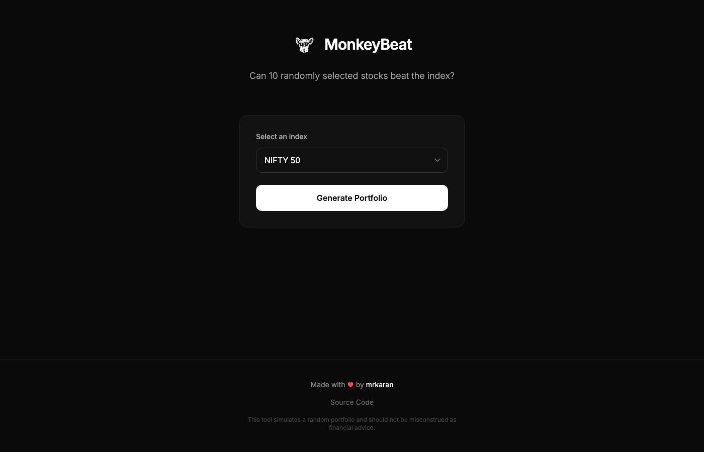

# MonkeyBeat

> **Can random stock picks beat professional fund managers?**

MonkeyBeat generates equi-weighted portfolios of 10 randomly selected stocks from NSE indices and compares their performance against the underlying benchmark.

Test the "monkeys throwing darts" hypothesis yourself!



## Quick Start

```bash
# Requires Python 3.12+ and uv
uv run app.py
```

Open http://localhost:7777

First run takes 5-10 minutes to fetch 5 years of stock data from Yahoo Finance.

## Features

- **Single file app** - Everything in `app.py` (~850 lines)
- **Zero setup** - Embedded DuckDB, no external database
- **9 NSE indices** - From NIFTY 50 to Smallcap 250
- **Monte Carlo simulations** - 100 random portfolios per request
- **Fast** - ~150ms response after data is loaded
- **Shareable** - UUID-based links with social sharing

## Supported Indices

| Index | Stocks | Category |
|-------|--------|----------|
| NIFTY 50 | 50 | Large Cap |
| NIFTY Next 50 | 50 | Large Cap |
| NIFTY 100 | 100 | Large Cap |
| NIFTY 200 | 200 | Large Cap |
| NIFTY 500 | 500 | Large Cap |
| NIFTY Midcap 100 | 100 | Mid Cap |
| NIFTY Midcap 150 | 150 | Mid Cap |
| NIFTY Smallcap 100 | 100 | Small Cap |
| NIFTY Smallcap 250 | 250 | Small Cap |

## How It Works

1. Select an index from the dropdown
2. App randomly picks 10 stocks from that index
3. Calculates returns over 1M, 6M, 1Y, 3Y, and 5Y periods
4. Compares against the benchmark index
5. Runs 100 Monte Carlo simulations to show win rate

## Project Structure

```
monkeybeat/
├── app.py                    # FastAPI app (uv inline dependencies)
├── templates/                # Jinja2 templates
│   ├── base.html            # Layout with HTMX, Tailwind, Lightweight Charts
│   ├── portfolio.html       # Results page
│   └── error.html
├── scripts/
│   ├── download_indices.sh  # Fetch latest index constituents
│   └── ind_*.csv            # Index constituent lists
├── static/                   # Logo, favicon
└── data/                     # DuckDB database (auto-created)
```

## Tech Stack

- [FastAPI](https://fastapi.tiangolo.com/) - Web framework
- [DuckDB](https://duckdb.org/) - Embedded analytics database
- [yfinance](https://github.com/ranaroussi/yfinance) - Yahoo Finance data
- [HTMX](https://htmx.org/) - Dynamic HTML
- [Tailwind CSS](https://tailwindcss.com/) - Styling
- [Lightweight Charts](https://tradingview.github.io/lightweight-charts/) - TradingView charts
- [uv](https://github.com/astral-sh/uv) - Python package manager

## Updating Index Data

```bash
./scripts/download_indices.sh
```

## Why Does the Monkey Usually Win?

1. **Equal weighting** - Your portfolio weights each stock equally, while indices are cap-weighted
2. **Survivorship bias** - Current index members are "survivors"; poor performers were removed
3. **Concentration** - 10 stocks can get lucky with 1-2 multibaggers

## License

[MIT](LICENSE)

## Credits

- Logo by [@hashfyre](https://twitter.com/hashfyre)

## Disclaimer

This is for educational/entertainment purposes only. Not financial advice. Past performance does not guarantee future results.
